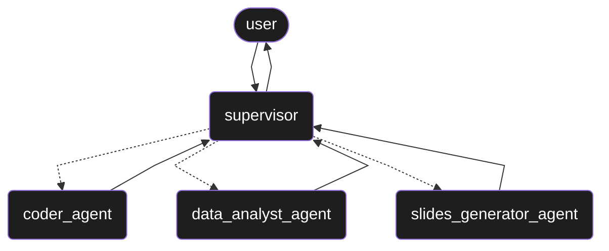

# 🤖 AI Data Scientist

A hierarchical multi-agent system to mimic the job duties of a data scientist,
built using LangGraph and vanna.ai.

## Features

- Coder Agent: Generates and executes Python code, returning results.
- Data Analyst Agent: Answers questions about data using text-to-SQL.
- Slides Generator Agent: Creates PowerPoint presentations.

The agents are managed by a supervisor to fulfill user requests, with short-term memory persistence.



## Usage

### Setup

1. Clone the repository
    ```bash
    git clone https://github.com/cintiaching/ai-data-scientist
    cd ai-data-scientist
    ```
2. Install dependency using uv
    ```bash
    uv sync
    source .venv/bin/activate
    ```
     
3. Create `.env` file from `.env.example` and set the required environment variables.

### Ingest Data

This project uses an SQLite database to store data. By default, it pulls data from [dataceo/sales-and-customer-data](https://www.kaggle.com/datasets/dataceo/sales-and-customer-data) 
on Kaggle. The data will be automatically downloaded from Kaggle Hut when running ingest_data.py. 
You can modify the script to ingest data of your choice.

### Training

Since it uses Vanna.ai, training is required for the agent to understand your data, similar to how a data scientist 
learns about their dataset. For more details, check [Vanna.ai Training Documentation](https://vanna.ai/docs/train/). 
Modify `train.py` to incorporate your domain knowledge and use case.

### LLM Setup

1. Navigate to `agents/llm.py` to configure the LLM settings.

2. Ensure the necessary environment variables are set for LLM configuration.

3. Model Recommendation: Use a smart LLM for code generation. For options, visit the [Chatbot Arena Benchmark](https://huggingface.co/spaces/lmarena-ai/chatbot-arena-leaderboard)

### Entry script

```bash
python main.py
```
